# 🚀 AWS Production Infrastructure using Terraform

> Production-grade AWS Infrastructure as Code (IaC) project built with Terraform following AWS Well-Architected principles.

<p align="center">


</p>

---

# 📖 Project Overview

This project demonstrates the deployment of a **production-style AWS infrastructure** using **Terraform** with separate **Development** and **Production** environments.

The infrastructure follows Infrastructure as Code (IaC) best practices and includes:

- Multi-environment architecture
- Custom VPC networking
- Public and Private Subnets
- Internet Gateway
- NAT Gateway
- Application Load Balancer
- Auto Scaling Group
- Launch Templates
- Amazon RDS MySQL
- Remote Terraform State using Amazon S3
- Terraform State Locking using DynamoDB
- GitHub Actions CI Workflow

---

# 🏗 Architecture Diagram

<p align="center">

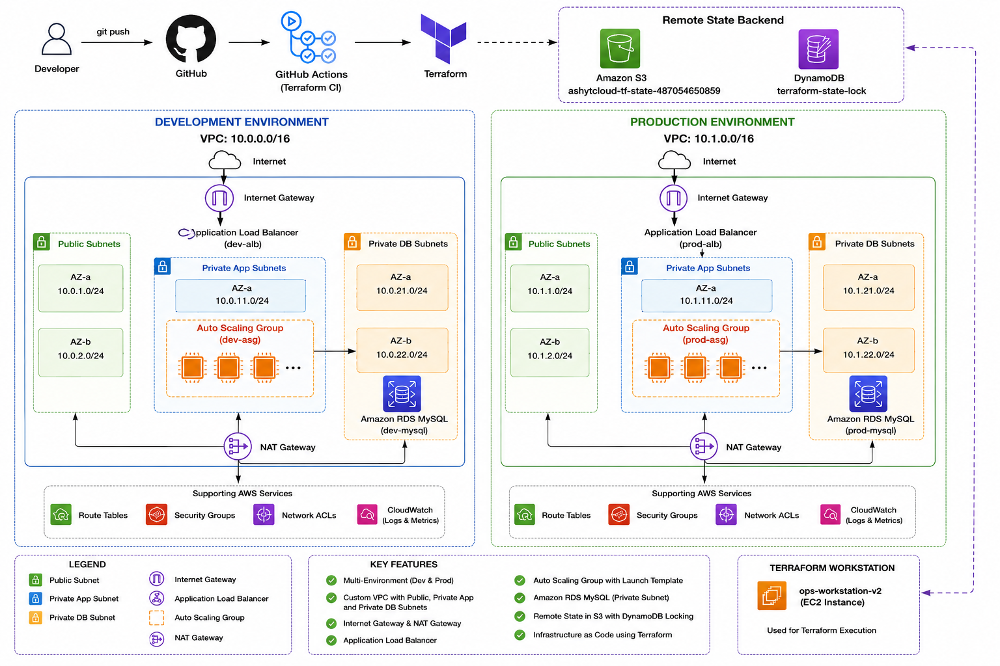

</p>

---

# ⚙ Architecture Overview

```
Developer
     │
     ▼
GitHub Repository
     │
GitHub Actions
     │
Terraform
     │
──────────────────────────────────────────
Remote State
• Amazon S3
• DynamoDB State Lock
──────────────────────────────────────────

Development Environment
• VPC
• Public Subnets
• Private App Subnets
• Private DB Subnets
• Internet Gateway
• NAT Gateway
• Application Load Balancer
• Auto Scaling Group
• Launch Template
• EC2
• Amazon RDS

Production Environment
• Same Architecture
```

---

# ☁ AWS Architecture

## Development Environment

| Component | Configuration |
|------------|---------------|
| VPC | 10.0.0.0/16 |
| Public Subnets | 10.0.1.0/24, 10.0.2.0/24 |
| Private App Subnets | 10.0.11.0/24, 10.0.12.0/24 |
| Private DB Subnets | 10.0.21.0/24, 10.0.22.0/24 |

---

## Production Environment

| Component | Configuration |
|------------|---------------|
| VPC | 10.1.0.0/16 |
| Public Subnets | 10.1.1.0/24, 10.1.2.0/24 |
| Private App Subnets | 10.1.11.0/24, 10.1.12.0/24 |
| Private DB Subnets | 10.1.21.0/24, 10.1.22.0/24 |

---

# 🚀 Infrastructure Components

- Amazon VPC
- Internet Gateway
- NAT Gateway
- Route Tables
- Public Subnets
- Private Application Subnets
- Private Database Subnets
- Security Groups
- Launch Templates
- Auto Scaling Groups
- Application Load Balancer
- Target Groups
- EC2 Instances
- Amazon RDS MySQL
- IAM Roles & Instance Profiles
- Amazon S3 Backend
- DynamoDB Lock Table

---

# 📁 Repository Structure

```
aws-production-infrastructure-terraform/

├── environments/
│   ├── dev/
│   └── prod/
│
├── modules/
│   ├── networking/
│   ├── compute/
│   ├── database/
│   ├── loadbalancer/
│   └── iam/
│
├── docs/
│   ├── architecture/
│   └── screenshots/
│
├── .github/
│   └── workflows/
│
└── README.md
```

---

# 📸 Infrastructure Screenshots

## AWS Infrastructure Overview

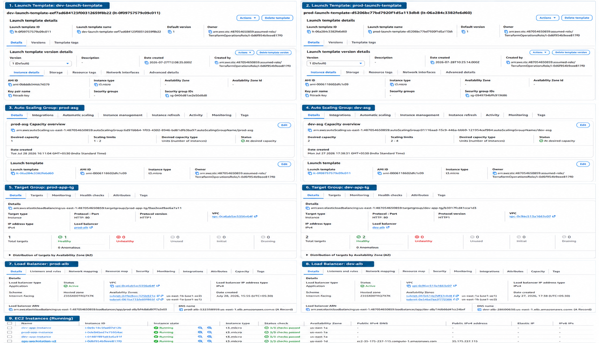

---

## VPC Overview

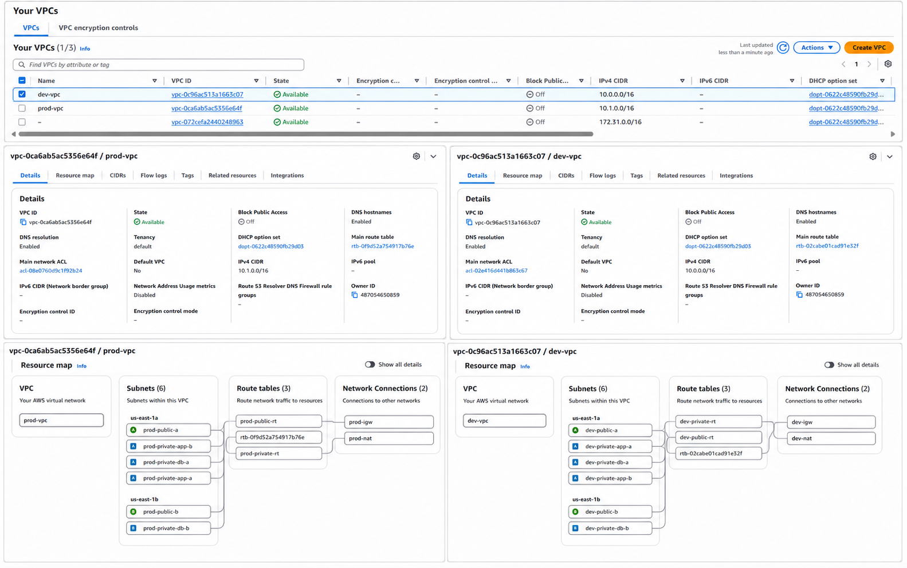

---

## Amazon RDS

### Development

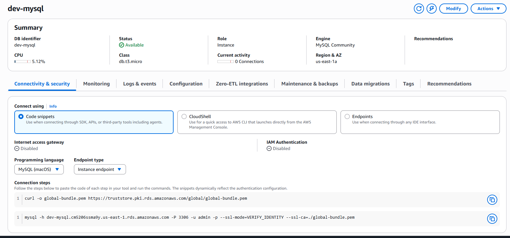

### Production

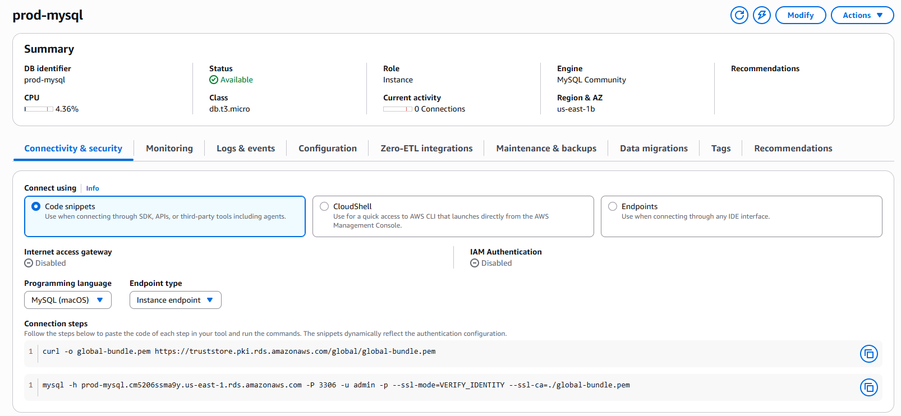

---

## Remote Terraform State

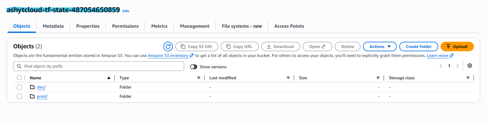

---

## DynamoDB State Locking

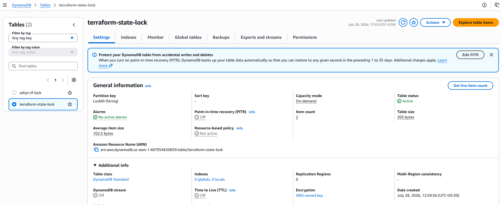

---

## Terraform Outputs

### Development

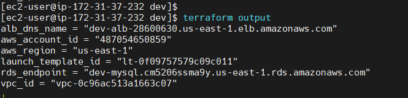

### Production

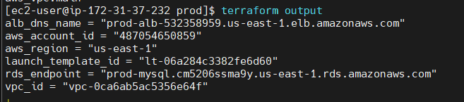

---

## Terraform State

### Development

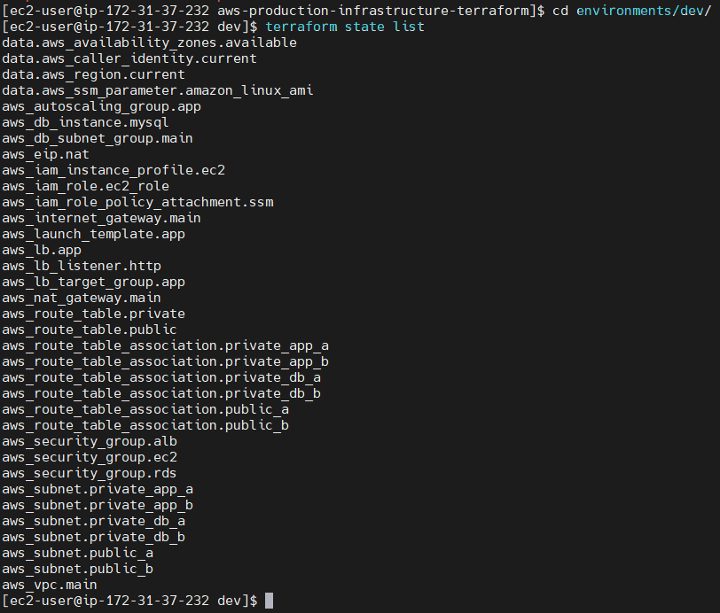

### Production

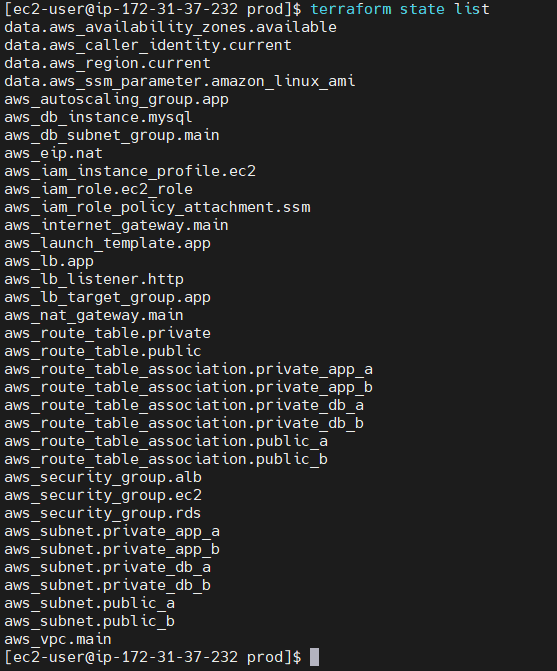

---

# 🔐 Remote State Management

Terraform remote state is configured using:

- Amazon S3 Backend
- DynamoDB State Locking

Benefits:

- Team collaboration
- State consistency
- Safe concurrent deployments
- Versioned infrastructure state

---

# 🔄 Deployment Workflow

```
Developer

↓

Git Push

↓

GitHub Repository

↓

GitHub Actions

↓

Terraform Init

↓

Terraform Plan

↓

Terraform Apply

↓

AWS Infrastructure
```
## GitHub Actions CI Pipeline

A GitHub Actions workflow is included to automate Terraform operations.

Current workflow stages:

- Checkout repository
- Install Terraform
- Terraform Init
- Terraform Validate
- Terraform Plan

> **Note:** The workflow is intentionally not fully operational because AWS authentication (GitHub OIDC or IAM Access Keys) was not configured. Infrastructure deployment for this project was executed securely from an EC2 instance using an IAM Role (`TerraformOperationsRole`).

Future enhancement:
- Configure GitHub OIDC authentication
- Enable automated `terraform plan` on pull requests
- Enable controlled `terraform apply` after approval

## GitHub Actions Workflow

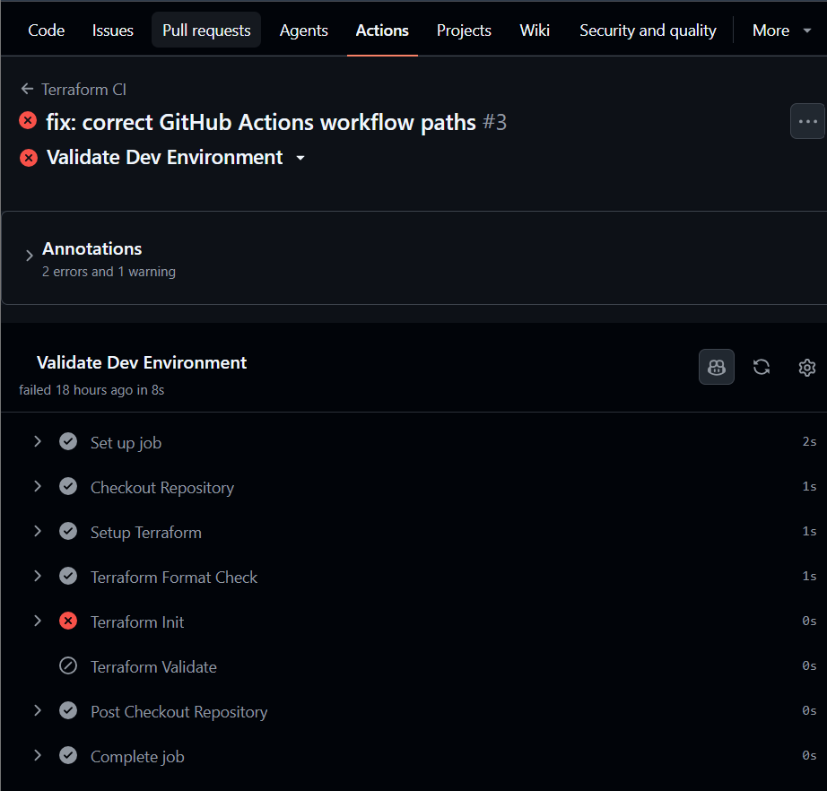

---

# 🛠 Technologies Used

- Terraform
- AWS
- Git
- GitHub
- GitHub Actions
- Amazon VPC
- Amazon EC2
- Amazon RDS
- Application Load Balancer
- Auto Scaling
- Amazon S3
- DynamoDB
- IAM

---

# 📚 Skills Demonstrated

- Infrastructure as Code (IaC)
- Terraform Modules
- Multi-Environment Infrastructure
- AWS Networking
- High Availability Design
- Security Groups
- Load Balancing
- Auto Scaling
- Database Provisioning
- Remote State Management
- Git Branching Strategy
- CI/CD Fundamentals

---

# 💡 Lessons Learned

During this project I learned how to:

- Design production-ready AWS infrastructure
- Build reusable Terraform configurations
- Manage multiple environments
- Configure remote Terraform state
- Implement state locking
- Deploy highly available infrastructure
- Use Launch Templates and Auto Scaling
- Organize Infrastructure as Code projects following industry best practices

---

# 🔮 Future Improvements

- Amazon EKS Integration
- AWS WAF
- ACM + HTTPS
- Route53
- CloudFront
- AWS Secrets Manager
- Monitoring with CloudWatch Dashboards
- GitHub Actions OIDC Authentication
- Blue/Green Deployment
- Terraform Cloud Integration

---

# 👨‍💻 Author

**Ashish Thakur**

Cloud & DevOps Engineer

GitHub:
https://github.com/ashyT-Cloud

---

⭐ If you found this project useful, consider giving it a star!
